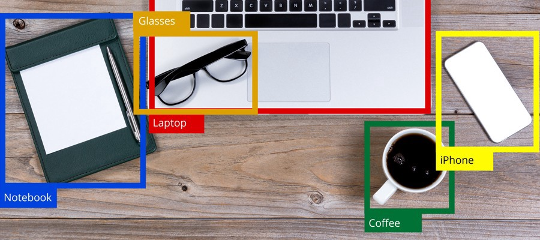

# mAP: Mean Average Precision for Object Detection

A simple library for the evaluation of object detectors.

<p align="center">
  
</p>

In practice, a **higher mAP** value indicates a **better performance** of your detector, given your ground-truth and set of classes.

## Install the latest version

```bash
pip install --upgrade git+https://github.com/bes-dev/mean_average_precision.git
```

## Example
```python
import numpy as np
from mean_average_precision import MeanAveragePrecision

# [xmin, ymin, xmax, ymax, class_id, difficult]
gt = np.array([
    [439, 157, 556, 241, 0, 0],
    [437, 246, 518, 351, 0, 0],
    [515, 306, 595, 375, 0, 0],
    [407, 386, 531, 476, 0, 0],
    [544, 419, 621, 476, 0, 0],
    [609, 297, 636, 392, 0, 0]
])

# [xmin, ymin, xmax, ymax, class_id, confidence]
preds = np.array([
    [429, 219, 528, 247, 0, 0.460851],
    [433, 260, 506, 336, 0, 0.269833],
    [518, 314, 603, 369, 0, 0.462608],
    [592, 310, 634, 388, 0, 0.298196],
    [403, 384, 517, 461, 0, 0.382881],
    [405, 429, 519, 470, 0, 0.369369],
    [433, 272, 499, 341, 0, 0.272826],
    [413, 390, 515, 459, 0, 0.619459]
])

# create metric_fn PASCAL VOC
metric_fn = MeanAveragePrecision(num_classes=1, iou_thresholds=0.5, is_pascal=True)

# create metric_fn COCO
metric_fn = MeanAveragePrecision(num_classes=1, iou_thresholds=np.arange(0.5, 1.0, 0.05))

# add some samples to evaluation
for i in range(10):
    metric_fn.add(preds, gt)

# compute metric
metric = metric_fn.value()

# print metric
print(metric["mAP"])
```